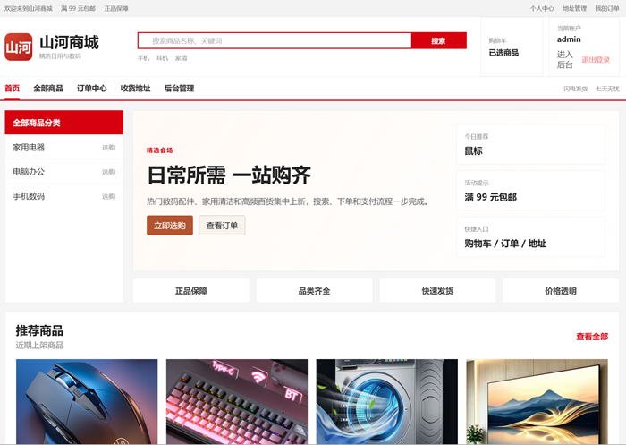
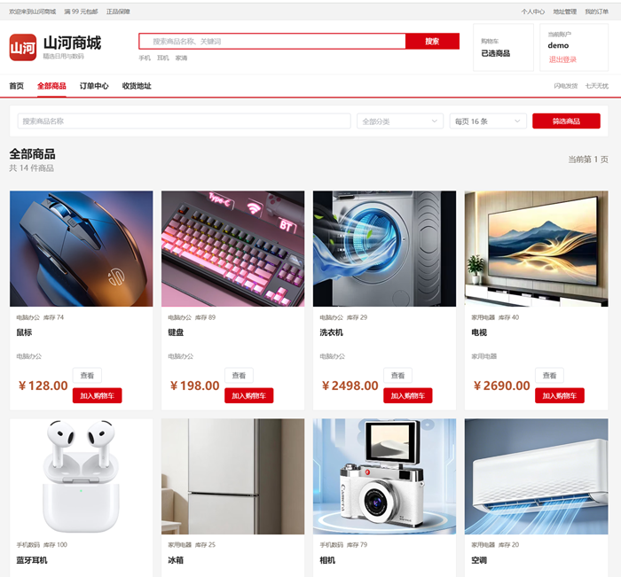
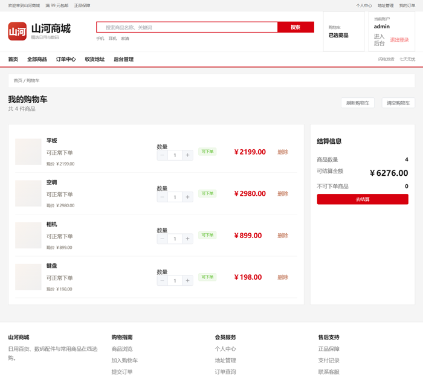
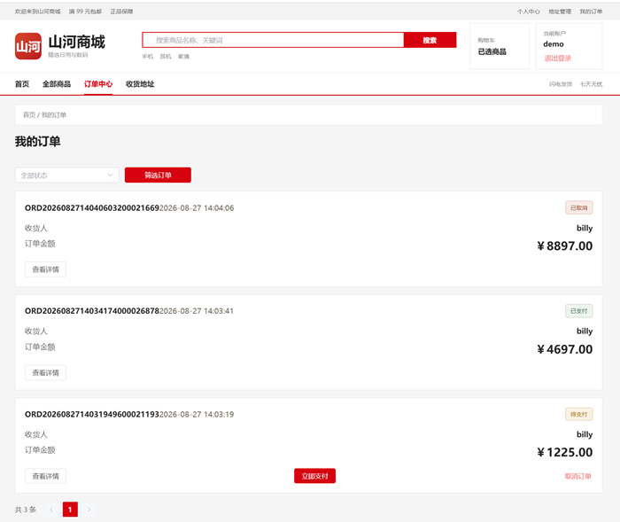
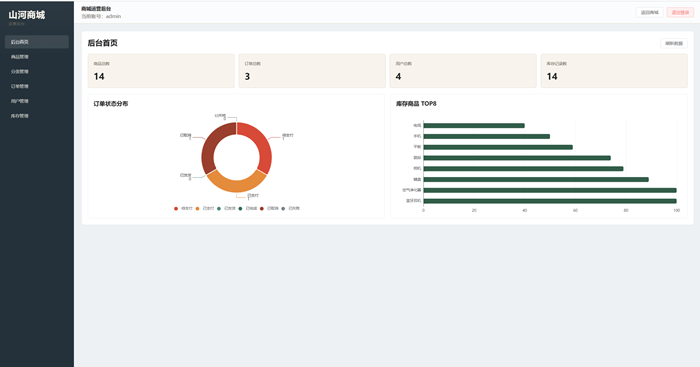
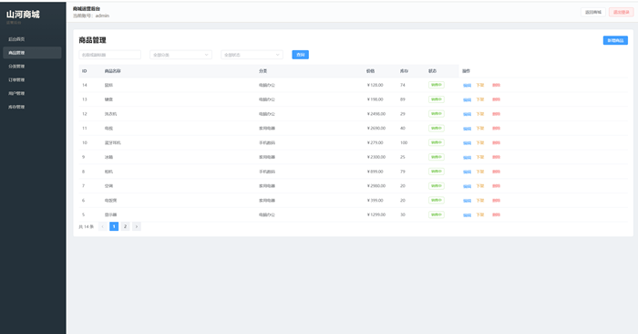
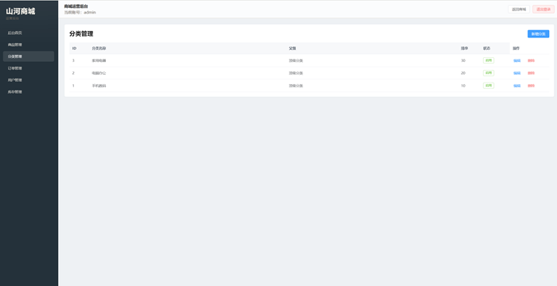
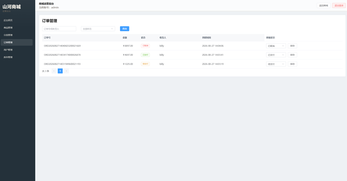
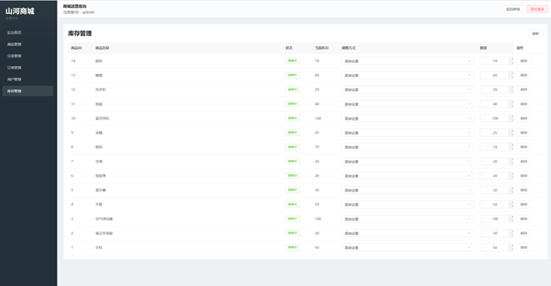

# 基于 Vue3 + Node.js 的微服务商城系统

## 项目简介

本项目是一个微服务商城系统，前端采用 Vue3，后端采用 Node.js + Express，围绕网关、用户、商品、购物车、订单、支付六个服务展开

##项目截图

## 技术栈

- 前端：Vue3、Vite、Pinia、Vue Router、Axios
- 后端：Node.js、Express、JWT
- 数据库：MySQL
- 缓存：Redis
- 消息队列：RabbitMQ
- 容器：Docker、Docker Compose

## 快速启动

1. 安装依赖：`npm run bootstrap`
3. 启动全部服务：
   - Docker 方式：`npm run docker:up`
   - 本地方式：按run.md逐个启动
4. 访问：
   - 前端：`http://localhost:5173`
   - 网关：`http://localhost:3000/health`
   - RabbitMQ 管理台：`http://localhost:15672`

## 测试账号

- 普通用户：`demo / User123!`
- 管理员：`admin / Admin123!`
- 备用管理员：`operator / Admin123!`
